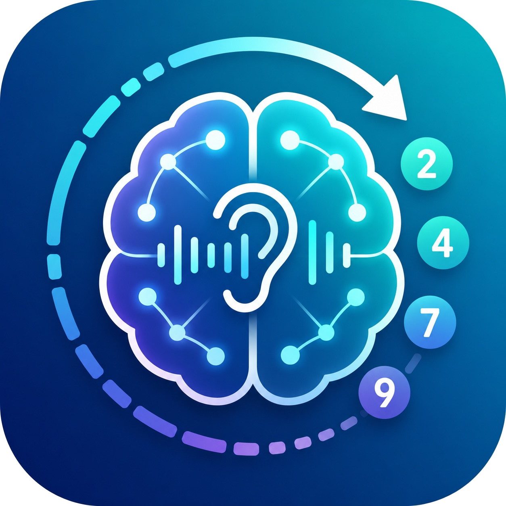

# PASAT-3 Selbsttest



A browser-based self-assessment app for the **Paced Auditory Serial Addition Test (PASAT-3)**.

---

## What is PASAT?

The **Paced Auditory Serial Addition Test** is a neuropsychological test originally developed by Gronwall (1977) and later adopted by the Multiple Sclerosis Functional Composite (MSFC) as a standardised measure of cognitive processing speed and working memory.

The test works like this: a series of single-digit numbers (1–9) is read aloud at a fixed pace. After each new number, the participant must add it to the **immediately preceding** number — not maintain a running total. For example:

> Numbers heard: **2, 5, 3, 8**
> Correct answers: **7** (2+5), **8** (5+3), **11** (3+8)

The standard version (**PASAT-3**) presents numbers every **3 seconds** over a sequence of 61 numbers, yielding 60 possible answers. A faster variant (**PASAT-2**) uses a 2-second interval for more advanced testing.

Because each answer requires simultaneously holding the last number in working memory, processing the new one, and producing a sum under time pressure, the test is sensitive to cognitive fatigue, processing-speed deficits, and attention lapses — commonly seen in conditions such as multiple sclerosis, traumatic brain injury, and other neurological disorders.

> **This app is for personal practice and self-assessment only. It is not a medical diagnostic instrument and does not replace clinical evaluation. Results are not clinically validated.**

---

## About this project

This is a lightweight, privacy-first single-page web app. There is no backend, no user accounts, and no data leaves the device. Settings are optionally persisted in `localStorage`; all other state is session-only.

### Features

- Full PASAT-3 and PASAT-2 test (60 or 30 answers, configurable interval)
- 10-number practice run before the real test
- Speech synthesis via the **Web Speech API** — no audio files required
- Timing anchored to TTS `onstart` for best possible accuracy
- Input via keyboard (desktop) or on-screen numeric pad (mobile/touch)
- Reaction time tracking per answer
- Chunking-error detection (a common mistake where the user adds their previous answer instead of the spoken number)
- Results screen with per-item breakdown, accuracy, and average reaction time
- Dark mode
- Mobile-first, Apple-style design — works well on iPhone/iPad and desktop browsers

### Tech stack

| Concern | Choice |
|---|---|
| Build | Vite |
| Framework | React 18 (JavaScript) |
| Styling | Tailwind CSS |
| Audio | Web Speech API (`SpeechSynthesisUtterance`) |
| State | React Hooks — `useReducer` for the test state machine |
| Persistence | `localStorage` for settings only |
| Routing | None (single-page flow) |

### Browser support

| Browser | Status |
|---|---|
| Chrome / Edge | Fully supported |
| Firefox | Supported (limited voice selection) |
| Safari | Supported (voices load asynchronously — handled) |
| Mobile Safari | Supported (user gesture on Start button satisfies autoplay policy) |

---

## Getting started

```bash
npm install
npm run dev
```

Build for production:

```bash
npm run build
```

---

## Project structure

```
src/
  components/
    StartScreen.jsx       # Landing page, instructions, disclaimer
    SettingsPanel.jsx     # Voice, speed, test length, interval, dark mode
    TestRunner.jsx        # Active test: counter, circular gauge, answer input
    AnswerInput.jsx       # Number field + optional touch keypad (0–18)
    NumberDisplay.jsx     # Subtle pulse dot on each number onset
    IntervalProgress.jsx  # SVG ring gauge showing remaining answer time
    ResultScreen.jsx      # Score, accuracy, reaction time, per-item table
  hooks/
    usePasatEngine.js     # Test state machine (useReducer), TTS orchestration, scoring
    useSpeech.js          # Web Speech API wrapper
  lib/
    numberSequence.js     # Generates valid 1–9 sequences with anti-repeat logic
    scoring.js            # Computes score, accuracy, reaction times, chunking errors
    speechVoices.js       # Filters and groups available voices by language
```

---

## Disclaimer

This application is intended solely for personal practice and self-assessment. It is **not** a medical device, does not produce clinically validated results, and does not replace examination by a qualified healthcare professional.

---

## References

- Gronwall, D. M. A. (1977). Paced auditory serial-addition task: A measure of recovery from concussion. *Perceptual and Motor Skills*, 44(2), 367–373.
- Fischer, J. S., et al. (1999). The Multiple Sclerosis Functional Composite Measure (MSFC): An integrated approach to MS clinical outcome assessment. *Multiple Sclerosis*, 5(4), 244–250.
